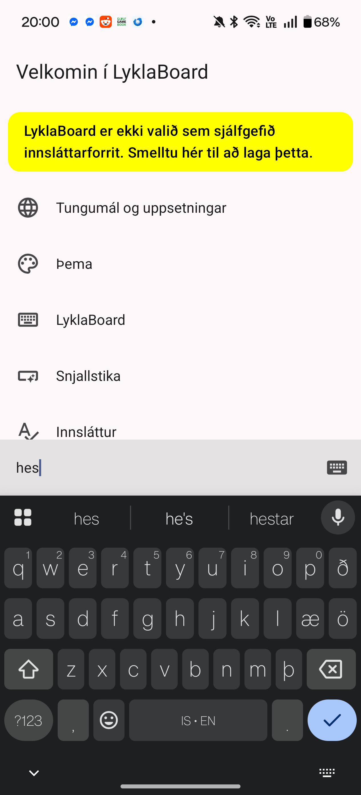
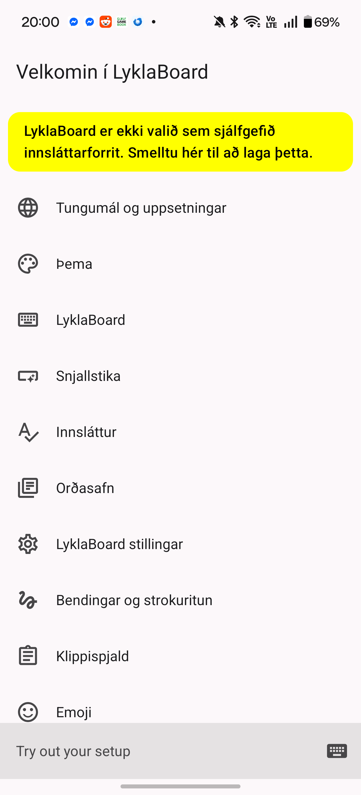
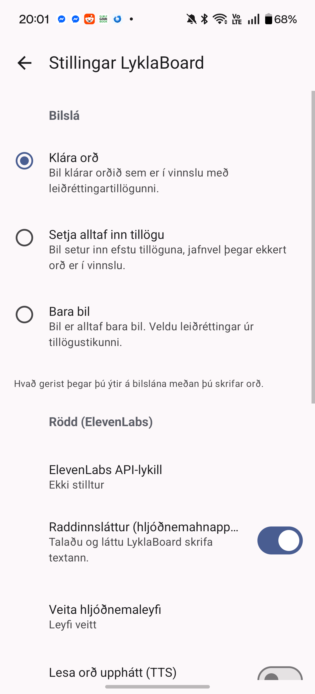

<p align="center">
  
</p>

<h1 align="center">LyklaBoard</h1>

<p align="center">
  <strong>Íslenskt lyklaborð sem skilur íslensku — líka frábæra ensku.</strong><br>
  <em>A privacy-first Icelandic + English keyboard for Android.</em>
</p>

<p align="center">
  Morphology-aware autocorrect · next-word prediction · on-device learning · optional ElevenLabs voice.
</p>

It is a fork that combines two projects:

- **[LyklabordApp](https://github.com/jokull/LyklabordApp)** (Jökull Sólberg) — the original
  iOS Icelandic keyboard. Its Swift typing engine (lexicon, morphology, noisy-channel
  corrector, predictor, personal learning) has been re-implemented **1:1 in Kotlin** here.
- **[FlorisBoard](https://github.com/florisboard/florisboard)** (Apache-2.0) — the Android
  keyboard shell (layouts, Compose settings UI, IME infrastructure). LyklaBoard adds the
  Icelandic intelligence behind FlorisBoard's `NlpProvider` seam.

Both upstreams are Apache-2.0; see [`LICENSE`](LICENSE). FlorisBoard attribution is retained
throughout the app.

---

## Features

- **Icelandic + English typing** — the `is-IS` layout with `ð æ ö þ` and long-press accents.
- **Icelandic-first, out of the box** — a fresh install types Icelandic (English as a
  secondary language) immediately, no subtype setup. The app interface is fully localized
  into Icelandic (`íslenskt viðmót`).
- **Morphology-aware autocorrect** — noisy-channel correction over the real Icelandic
  lexicon + BÍN morphology, with a verbatim (quoted-literal) escape hatch.
- **Completion & next-word prediction** — calibrated bilingual unigram/bigram blend.
- **On-device personal learning** — learns your words locally; editable in a dictionary
  screen (add / delete / export / SwiftKey import). Nothing leaves the device.
- **Three spacebar modes**, **emoji frecency**, and a **keyboard-height slider**.
- **ElevenLabs voice (optional)** — mic-key dictation (Speech-to-Text) and read-aloud
  (Text-to-Speech) using a native Icelandic voice. **You supply your own API key** in
  settings — no key is bundled in the app.

## Screenshots

<p align="center">
  
  
  
</p>

## Build it yourself

Requirements: Android SDK (API 26+, compile/target SDK 36), JDK 17+. Everything is under
[`AndroidClient/`](AndroidClient).

```bash
cd AndroidClient
echo "sdk.dir=/absolute/path/to/your/Android/sdk" > local.properties
./gradlew :app:assembleDebug
# → app/build/outputs/apk/debug/app-debug.apk
adb install -r app/build/outputs/apk/debug/app-debug.apk
```

Then enable **LyklaBoard** in Android Settings → *Languages & input → On-screen keyboards*
and switch to it. It types **Icelandic (with English as a secondary language) out of the
box** — no subtype setup needed. Add or change layouts anytime under the app's *Languages &
Layouts*.

## Install a prebuilt APK

Grab the latest APK from the [**Releases**](../../releases) page and sideload it
(enable "install unknown apps" for your browser/file manager).

## Voice (ElevenLabs) setup

Voice features are off until you add a key:

1. Get an API key from [elevenlabs.io](https://elevenlabs.io).
2. In the app: **LyklaBoard settings → Rödd (ElevenLabs)** → paste your key (stored only on
   your device, shown masked), grant the microphone permission, and pick a voice from the
   live list (populated from your ElevenLabs account).

The key never leaves your device and is never committed or bundled.

## Repository layout

- `AndroidClient/` — the Android app (Gradle project). This is what you build.
  - `lib/engine/` — the Kotlin typing engine (pure JVM, host-testable).
  - `app/` — the FlorisBoard-derived IME + LyklaBoard NLP provider, voice, and settings.
- `LICENSE` — Apache License 2.0.

The original iOS/Swift sources, linguistic corpora, and build tooling are **not** part of the
distributed repository (kept out of tree under a gitignored `.refrepos/`) to keep the fork
small and focused on the Android app. The engine's host-JVM parity tests reference that data
when present.

## Development

```bash
cd AndroidClient
./gradlew :lib:engine:test      # engine unit tests + Swift-parity scenario replay
./gradlew :app:assembleDebug    # build the APK
```

The Kotlin engine is a faithful port of the Swift engine; correctness is gated by replaying
the original Swift scenario suites against the Kotlin engine (requires the reference data).

## License & attribution

LyklaBoard is licensed under the **Apache License 2.0**. It includes and derives from
FlorisBoard (© The FlorisBoard Contributors) and re-implements the LyklabordApp engine
(© Jökull Sólberg). Their licenses and attribution are preserved.
