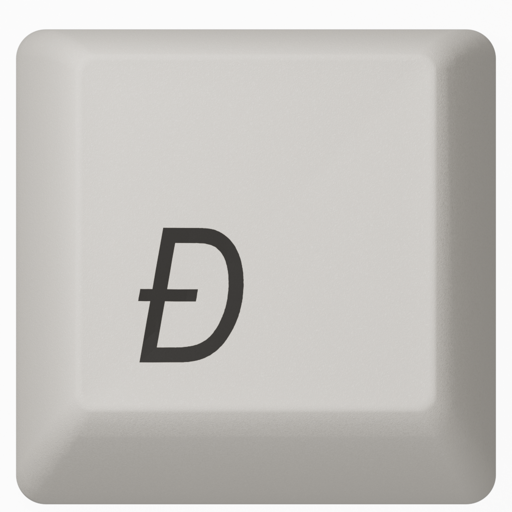

<p align="center">
  
</p>

<h1 align="center">Lyklaborð</h1>

<p align="center">
  <strong>Íslenskt lyklaborð sem skilur íslensku.</strong><br>
  <em>A privacy-first iOS keyboard for Icelandic — that also types excellent English.</em>
</p>

<p align="center">
  <a href="https://lyklabord.solberg.is"><strong>lyklabord.solberg.is</strong></a>
</p>

<p align="center">
  <sub>The landing page's hero is a real-time 3D render of an Apple Extended Keyboard II Ð-keycap — tap it, it presses.</sub>
</p>

Lyklaborð is what SwiftKey should have been for Iceland: one Icelandic layout that fluently blends Icelandic and English as you type, morphology-aware autocorrect built on [BÍN](https://bin.arnastofnun.is) (3 million word forms — the first keyboard on any platform that actually understands Icelandic inflection), and a hard privacy guarantee: **the keyboard extension contains zero networking code.** Verify it — that's why the source is here. An optional subscription, Lyklaborð+, adds on-device learning with a personal dictionary you fully control.

Base keyboard free forever. Open source. No account for the free tier. No telemetry. No AI bloat. Personal-vocabulary learning is an optional subscription (Lyklaborð+) — see below.

## Why

Apple's Icelandic keyboard has no real autocorrect (common words get "corrected" into rare ones). SwiftKey treats iOS as a second-class platform and phones home. Every quirk of both is documented in [research/swiftkey-frustrations.md](research/swiftkey-frustrations.md) — this keyboard is designed against that list.

## What's different

- **Icelandic + English on one layout** — a two-lane language model absorbs *slettur* (one-off English words mid-Icelandic) without flipping languages, but follows you decisively when you actually switch. Never hijacks your keyboard mid-sentence.
- **Morphology-aware**: all 3.70M BÍN word forms are valid vocabulary via a memory-mapped binary (built with [lemma-is](https://github.com/jokull/lemma-is)); the ~110MB model remains file-backed and demand-paged via mmap.
- **Under-corrects by design**: a word that's valid in either language is never auto-replaced; the literal token you typed always sits in the suggestion bar (quoted) as an escape hatch; URLs, emails, and dotted tokens are never mangled.
- **Spacebar near-miss correction**: `smelirna` → `smellir á` (the spacebar's neighbors are hypotheses, not typos).
- **Learning you own (Lyklaborð+)**: words are learned on-device (2 distinct days, or instantly when you tap the verbatim suggestion), individually deletable — deletions stick — and importable from a SwiftKey data export. Nothing you type in password, URL, or email fields is ever recorded.
- **SwiftKey muscle memory**: `.` key with long-press punctuation cluster right of space, spacebar cursor control, double-space period.

## Architecture

Five local Swift packages, no third-party dependencies beyond the vendored [KeyboardKit 9.9.1](Packages/KeyboardKit) (last fully-MIT release; we maintain our own fork):

| Package | Role |
|---|---|
| `LemmaCore` | mmap reader for the BÍN binary (validity + morphology) |
| `Lexicon` | mmap frequency lexicons (unigrams/bigrams, IS + EN) |
| [`TypeEngine`](Packages/TypeEngine/README.md) | spatial model, corrector, predictor, two-lane language model, typing session; start here for the engine architecture and debugging model |
| `Learning` | crash-safe event log + personal model (learned words, tombstones, touch stats) |
| `KeyboardKit` | vendored UI/layout framework (MIT) |

For the language side of the system—BÍN and morphology, the Miðeind stack,
`lemma-is`, corpora, frontier keyboard research, artifact provenance, and the
incremental intelligence roadmap—read
[`ICELANDIC_NLP.md`](ICELANDIC_NLP.md).

The extension reads everything from the app bundle and App Group container and never touches the network; the containing app owns compaction, the dictionary editor, and (soon) encrypted CloudKit sync of your personal data to your own iCloud.

## Building

```bash
brew install xcodegen
xcodegen generate
xcodebuild -scheme Lyklabord -destination 'generic/platform=iOS Simulator' build
```

Requires Xcode 26+, iOS 18 deployment target. Tests: `swift test` in each package under `Packages/`.

The typing engine runs headlessly on macOS — try it:

```bash
cd Packages/TypeEngine
swift run -c release type-repl            # interactive: type, see suggestions + language lane
swift run -c release type-repl run Scenarios/core.scenarios   # 81 behavioral regression scenarios
swift run -c release type-repl bench      # latency percentiles on the real language models
```

## Status

Early but daily-drivable: layout, blended autocorrect/prediction, learning + dictionary editor, and SwiftKey import all work. Pre-App-Store. See open items in the [table-stakes roadmap](research/tablestakes-roadmap.md).

## Data & licenses

Code is MIT. Icelandic language data is derived from **BÍN (Beygingarlýsing íslensks nútímamáls)**, © Árni Magnússon Institute for Icelandic Studies, used under the [BÍN conditions](https://bin.arnastofnun.is/DMII/LTdata/conditions/) — see [data/ATTRIBUTION.md](data/ATTRIBUTION.md). English frequency data from [SymSpell](https://github.com/wolfgarbe/SymSpell) (MIT). Evaluation sentences from Wikipedia (CC BY-SA 4.0). Full provenance in [data/README.md](data/README.md).
